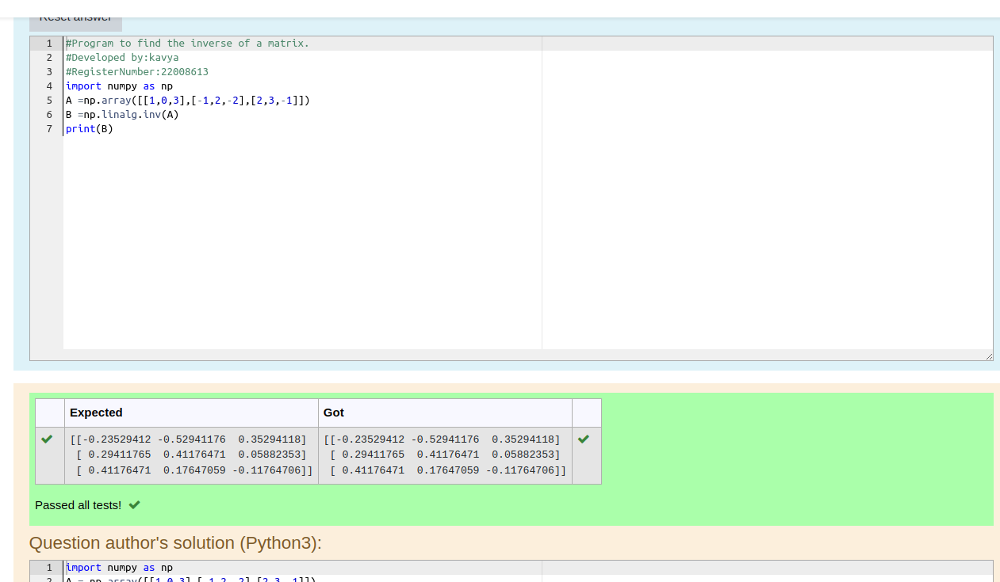

# INVERSE-OF-A-MATRIX
## Aim:
To write a python program to find the inverse of a matrix
## Equipment’s required:
1. 	Hardware – PCs
2. 	Anaconda – Python 3.7 Installation / Moodle-Code Runner
## Algorithm:
### Step1 : 
 import numpy as np
## Step 2: 
arrange the given matrix in np.array
## Step 3: 
then give a command of np.linalg.inv
## Step 4: 
print the program and get the output#Program to find the inverse of a matrix.

## Program:
```python
#Program to find the inverse of a matrix.
#Developed by: kavya.k
#RegisterNumber: 22008613
import numpy as np
A = np.array([[1,0,3],[-1,2,-2],[2,3,-1]])
B = np.linalg.inv(A)
print(B)
```
## Output:

## Result:
Thus the inverse of given matrix is successfully solved using python program

